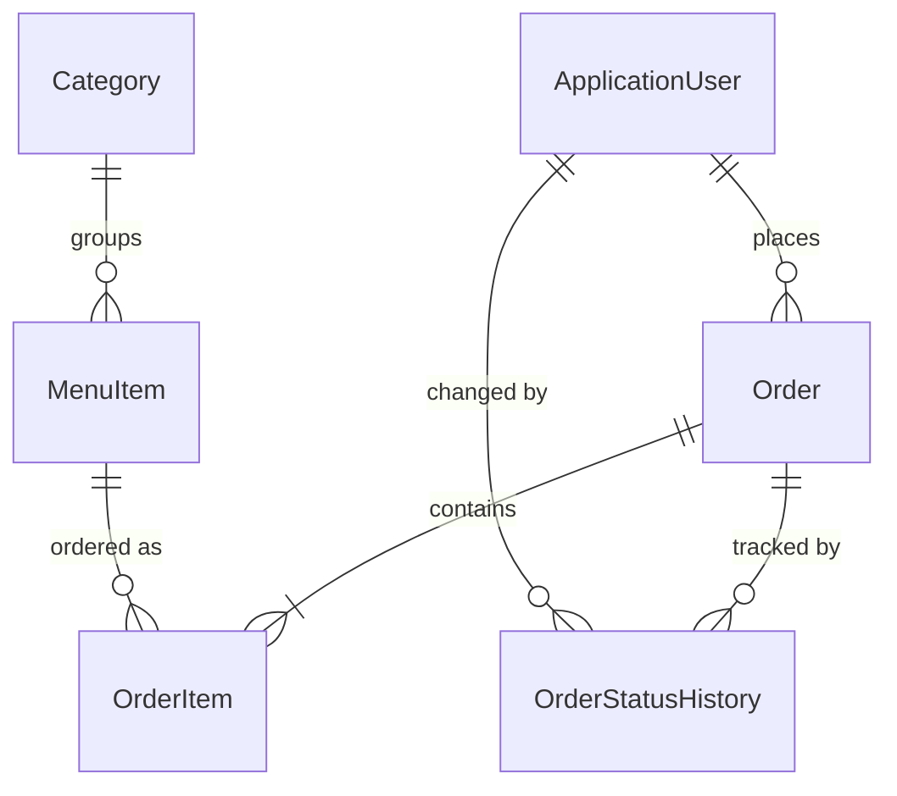

# RestaurantHub

Online restaurant ordering system with a **customer portal** and an **admin portal**,
built with ASP.NET Core MVC, EF Core (Code First), SQL Server and ASP.NET Core Identity.

## Features
**Customer**
- Browse the menu by category, session-based cart, checkout
- Order tracking with a status timeline; cancel while the order is still pending

**Admin**
- Manage categories and menu items (with secure image upload; "hide" instead of delete)
- Order dashboard with status filter and paging
- Order workflow with enforced status transitions and a full audit history (who / when)

**Platform**
- Role-based authorization (Admin / Customer) with ASP.NET Core Identity
- Custom middleware: request logging and global exception handling
- Planned: real-time notifications (SignalR) and an SSRS sales report

## Design decisions
- **Server-side pricing:** the browser sends only item ids and quantities; prices, tax and totals are computed on the server.
- **Price snapshots:** each order line stores the unit price and item name at purchase time, so later menu changes never rewrite history.
- **Restrict deletes:** deleting a menu item, category or user can never wipe order history.
- **State machine:** the server rejects illegal status moves (for example Pending to Delivered), even for forged requests.
- **Ownership checks:** customers can only see or cancel their own orders (IDOR protection).
- **Transactional checkout:** the order, its lines and its first history row are saved in one transaction.

## Tech stack
C# · ASP.NET Core MVC · Entity Framework Core · SQL Server · ASP.NET Core Identity · LINQ · Bootstrap

## Database

## Run locally
1. Install the .NET SDK and SQL Server (LocalDB works).
2. Clone the repo and check the connection string in `appsettings.json`.
3. Run `Update-Database` (Package Manager Console) or `dotnet ef database update`.
4. Run the app (`dotnet run --launch-profile https`). Demo data and a demo admin are created on first start.
   Demo admin (local use only): `admin@restauranthub.com` / `Admin123`

## What I learned
- Designing a relational model around history (snapshots, restrict deletes, audit trail)
- Treating all client input as untrusted (server-side pricing, ownership checks, anti-forgery tokens)
- Modelling a business workflow as a state machine
- Writing custom ASP.NET Core middleware and understanding pipeline order
